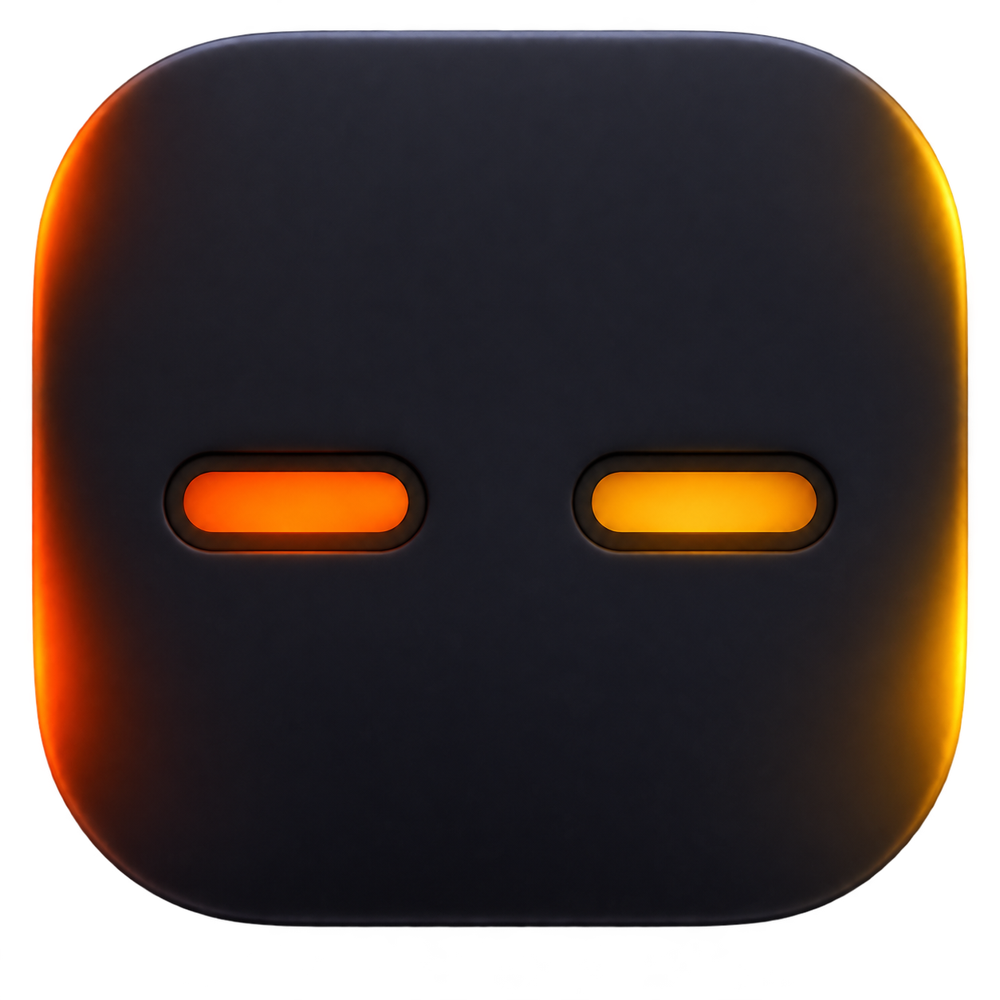

<h1 align="center">FlareBar</h1>

<p align="center">Cloudflare usage, in your menu bar.</p>

<p align="center">
  
</p>

<p align="center">
  
  
  
</p>

FlareBar is a free, native, read-only Cloudflare usage monitor. It shows your current allowance without opening the dashboard.

## Features

- **Workers** — requests and CPU usage
- **KV** — read operations
- **D1** — rows read and written
- **Durable Objects** — requests
- **Free and Paid plans** — daily or monthly allowances
- **Threshold alerts** — notifications at 80% and 95%
- **Adaptive refresh** — polls less while idle or in Low Power Mode
- **Cached snapshot** — keeps the last successful result during outages
- **Launch at login** — optional native macOS login item
- **Local credentials** — reuses Wrangler or stores a token with `0600` permissions

FlareBar cannot deploy Workers, edit Cloudflare resources, or change account settings.

## Install

FlareBar currently builds from source. Authenticate with Wrangler, then run the app:

```sh
npm install --global wrangler
wrangler login
git clone https://github.com/laurentlucian/FlareBar.git
cd FlareBar
swift run FlareBar
```

Requires macOS 14 or later and Swift 6.

You can also paste a Cloudflare API token with Analytics Read access inside FlareBar. It is stored at `~/.config/flarebar/token`.

## How it works

FlareBar queries Cloudflare's GraphQL Analytics API and displays usage against the included Free or Paid allowance. Free usage resets daily at 00:00 UTC; Paid usage resets monthly.

Refresh frequency adapts from two minutes while active to thirty minutes while idle or in Low Power Mode. The menu bar ring reflects the highest current percentage and warns at 80% and 95%.

No account, analytics, hosted service, webhook relay, or AI provider.

## Development

```sh
swift run FlareBar
swift test
```

## Architecture

- `MenuBarController` owns the status item and floating panel.
- `AppModel` schedules refreshes, caches snapshots, and sends alerts.
- `CloudflareClient` is the only network boundary.
- `TokenStore` loads Wrangler, environment, or locally saved credentials.
- SwiftUI renders the usage panel.

## Security

FlareBar makes read-only requests directly to Cloudflare. A pasted token stays on your Mac at `~/.config/flarebar/token` with owner-only permissions. Review the complete network path in `Cloudflare.swift`.

## License

MIT
